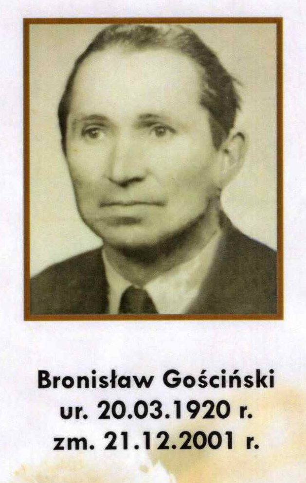
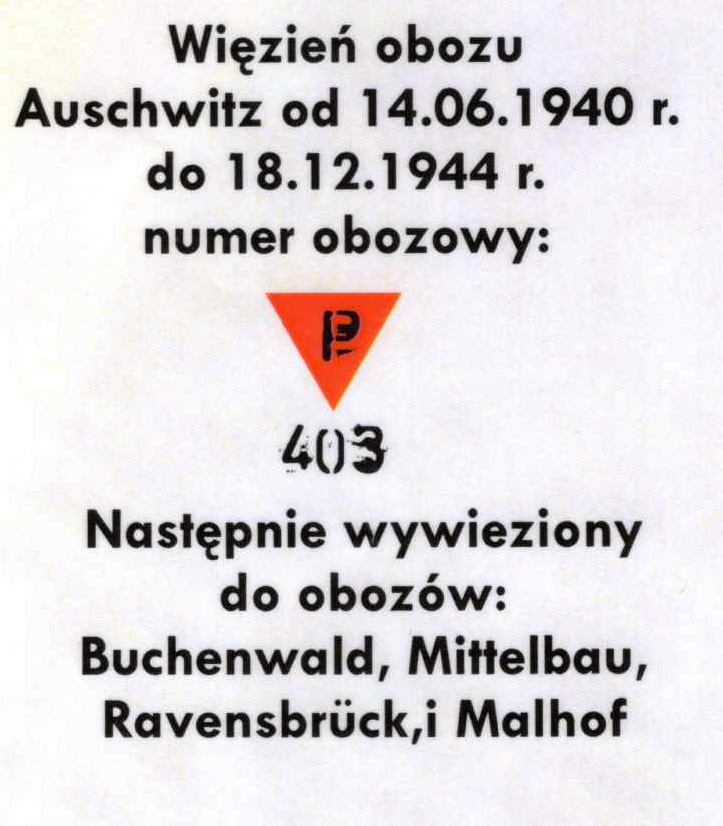

# Bronisław Gościński: Auschwitz History

Bronisław Gościński was born on March 20th 1920 in Muszyna. He was the oldest child of Jan Gościński and Marianna Gościńska (maiden name Miczułka). He had three brothers and two sisters. After finishing his education in primary school in Muszyna and secondary school in Nowy Sącz, he worked as a farmer.

On May 3rd 1940, Bronisław was arrested by a Gestapo officer while working with his father and was charged with being a member of an illegal underground Polish organization. He was transported to a prison in Nowy Sącz and then one in Tarnów. On June 14th 1940, Bronisław was moved to the concentration camp in Oświęcim (Auschwitz) with the first transport of people ever taken to the camp. He was given the number 403.

Bronisław’s time in the camp was brutal, however he fought through it by surviving one day at a time. During this time, he worked a variety of different jobs, ranging from gardening, harvesting rye, barracks construction, broommaking, working in and even taking care of paperwork in one of the warehouses. He quickly learnt that even the Nazis appreciated and needed skilled workers to maintain and later expand the camp. His prior work experience as well as his ability to learn new skills while in the camp allowed him to avoid the most dangerous jobs in the most hazardous conditions thus increasing his chance to survive. He also spoke German, which further increased his standing as a useful prisoner.

Bronisław had to learn how to make connections, get more food and avoid beatings in order not to die of exposure or exhaustion. He had to make the best of every opportunity and, of course, keep all of the extra food, tricks and privileges hidden from the Nazis otherwise they would have been taken away and he would have been punished.

His number, 403, also played a part in how he was treated in the camp. He was considered a “STARY NUMER”, an “OLD NUMBER”. Both the prisoners and the Nazis knew that a person who survived in the camp since its early days had to know their way around the place and was worth keeping around.

After a few years in the camp, Bronisław was considered one of the essential people who were not to be transported to any other death camps. Him and some others managed to get a relatively safe job in a warehouse. This meant that they were working inside, alleviating dangers of exposure, and gave them access to all sorts of goods to steal to make life a bit easier. At a certain point, Bronisław was trusted enough to be sent outside the camp to do certain tasks for the Nazis in the surrounding towns. He loaded and transported supplies, tools e.t.c. Whenever leaving the camp they were always accompanied by SS officers, however on some occasions, they were left alone giving him a chance to escape, however, he chose not to risk it.

Bronisław stayed in Oświęcim (Auschwitz) until December 18th 1944. After that he was moved to camp Buchenwald, where he worked in a quarry, then to camp Mittelbau, where he worked in an underground factory for V-1 (bomb) and V-3 (cannon). On April 1st 1945, he was transported via train to camp Ravensbruck. The journey itself took 13 days. The train drove in circles and stopped several times before reaching the camp. The prisoners on the train were loaded into cargo carriages, 50 people per carriage. They had to stand the entire time as there was very little space. Bronisław managed to make himself a makeshift hanging bed out of a blanket, which helped him survive the journey as he was sick.

At that time, the front lines were getting closer and they could hear the fighting going on on both sides. It was clear that Germany was losing control and the situation was getting quite chaotic. Bronisław stayed in Ravensbruck until the end of April. After that, the prisoners were gathered in groups of 500 and were told that they were released from the camp and the Nazis were ordered to get them to the Americans. They walked for days, sleeping in abandoned homes along the road. Bronisław and a few others separated from the group and managed to escape, however, they were caught again soon after.

Bronisław was taken to camp Mallhof where he would spend his last days as a prisoner. One morning all the Nazis suddenly gathered and left the camp, fleeing the Russian army. They left the prisoners unsupervised and the gate open. A rumor was beginning to spread among the prisoners that underneath the camp there was an ammunition storage which could explode at any moment and that is why the Nazis left so quickly. Therefore, Bronisław and many others did the same, took whatever could be useful from the camp and left.

The only way they could go for now was further west. Along the way they met the Russian soldiers who helped some of the sick and wounded, however, they did not tell Bronisław, or anyone else for that matter, where to go or what to do. They stayed in the area for some time and met a Polish man from a local militia. He told Bronisław that they could stay in the houses previously occupied by the Nazis. That was a luxury in comparison to camp conditions, decent beds, fully stocked kitchen and all the food and water they could need. Bronisław’s goal was, of course, to go back home, but he decided to stay in one of the Nazi houses for a while in order to regain strength for the journey.

After a few days, Bronisław and 5 others started walking home. Along the way they witnessed the destruction caused by the war. They were stopped by Russian soldiers a few times, they were robbed by them, however, they kept going. With help from a man with a car they eventually made it to Szczecin. At the border, they were forced to work for the Russians for 10 days. After that, they were released and managed to take a train going further into Polish territory.

After taking many different trains, a truck, a horse carriage and simply walking on foot, on June 1st 1945 Bronisław made it back to Muszyna. First thing he did was go into his local church, being inside one for the first time in 5 years as the prisoners were not allowed to express their faith. He tried to stay unnoticed, but the people recognized him and escorted him home. Bronisław survived and was reunited with his family.

## Card

The card translates:

> Prisoner of the Auschwitz camp from 14.06.1940 to 18.12.1944, camp number: [P] 403. Subsequently deported to the camps: Buchenwald, Mittelbau, Ravensbrück, and Malhof.

A couple of notes on the details: the red triangle with the letter "P" was the badge marking Polish political prisoners in Nazi concentration camps (the letter indicated nationality, the color indicated the prisoner category). The chain of camps listed — Buchenwald, Mittelbau, Ravensbrück, and what looks like "Malhof" — suggests this person survived over four years at Auschwitz before being transferred elsewhere as the camp system was evacuated later in the war.

There is an exact match in the official Auschwitz Memorial's list of the first transport of Polish prisoners:

Prisoner No. 403: Bronisław GOŚCIŃSKI

Born 20.03.1920 in Muszyna
Arrived at Auschwitz on 14 June 1940, as part of the first mass transport — 728 Polish political prisoners sent from the prison in Tarnów. This was the transport that effectively opened the camp; prisoner numbers 31–758 were assigned to it in arrival order (1–30 had already gone to German criminal prisoners brought in from Sachsenhausen).
In 1944, transferred to Buchenwald — matching the deportation chain listed on the card. 
Auschwitz-Birkenau
He survived the war. 
Auschwitz-Birkenau

This lines up precisely with everything on the card: the arrival date (14.06.1940), the departure date (18.12.1944, presumably his transfer-out date to Buchenwald), the number 403, and Buchenwald as the first onward camp — the record card additionally names Mittelbau, Ravensbrück, and "Malhof" as further stops after Buchenwald, which the summary source doesn't detail but is entirely consistent with the chaotic camp transfers of late 1944–45.
