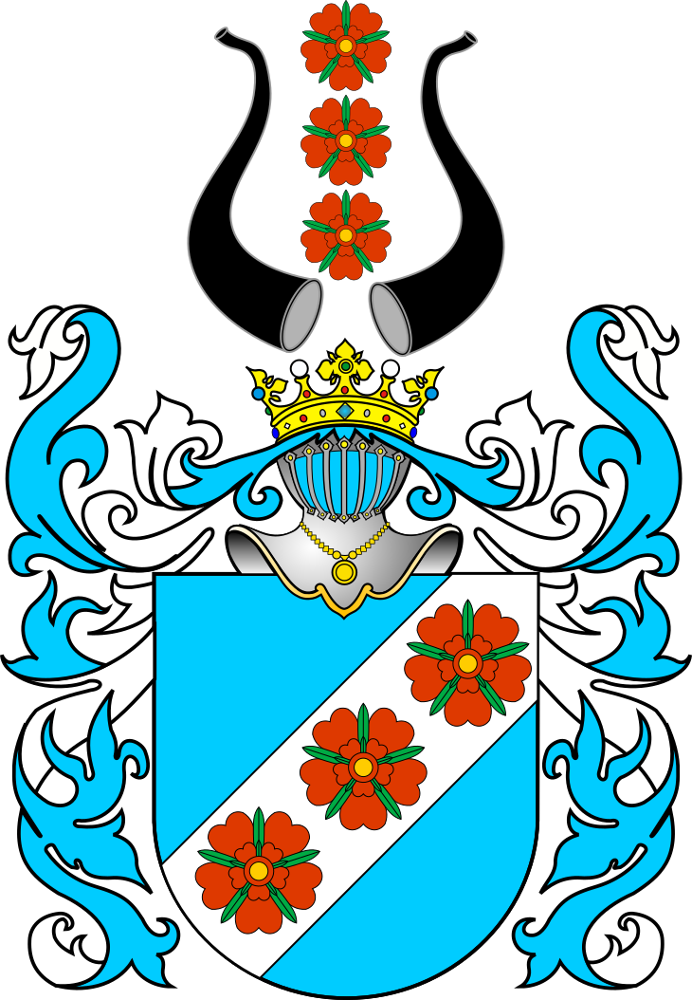

# The Gościński Name

## Meaning and origin

The Polish Academy of Sciences’ surname dictionary gives two plausible origins:

- **Occupational:** from the old dialect word *gościński*, meaning an **innkeeper or tavern keeper**.
- **Geographic:** “a person from” a place such as **Goszczyn, Goszczynno, or Goszczyno**. The suffix *-ski* originally indicated association with or origin from a place.

Those place-names ultimately relate to the old Polish root *gość*, meaning “guest,” “visitor,” or originally “stranger/newcomer.” Some may instead derive through old personal names such as **Gościmir** or **Gościsław**. The surname alone cannot establish which explanation applies to a particular family. [Polish Academy of Sciences surname dictionary](https://nazwiska.ijppan.pl/haslo/show/name/GO%C5%9ACI%C5%83SKI), [Goszczyn municipal history](https://bip.goszczyn.pl/index.php?cmd=zawartosc&id=30&opt=pokaz)

## Pronunciation

Approximately:

- **Gościński:** *gosh-CHEEN-skee*
- **Gościńska:** *gosh-CHEEN-skah*

The stress falls on **-ciń-**. More precisely, Polish **ś** and **ć** are soft consonants, so the beginning is slightly softer than English “gosh-ch.”

## Why there are two forms

Polish surnames ending in *-ski* behave like adjectives:

- man: **Jan Gościński**
- woman: **Anna Gościńska**
- family or mixed plural: **Gościńscy**

Thus, *Gościńska* is normally the feminine form of the same surname—not a separate family name. Outside Poland, women frequently retain the standardized immigrant spelling **Goscinski**.

## Frequency and geography

The Polish Academy’s reference entry reports **1,133 bearers in Poland**—546 men and 587 women. The largest concentrations are in:

- Kujawsko-Pomorskie
- Małopolskie
- Wielkopolskie
- Pomorskie

An especially notable local concentration occurs around **Muszyna and Nowy Sącz** in southern Poland. There are also clusters around Bydgoszcz, Suwałki, Toruń, Elbląg, Konin, and northern Polish districts. This spread strongly suggests that not every Gościński family necessarily has the same origin. [Polish Academy distribution data](https://nazwiska.ijppan.pl/haslo/show/name/GO%C5%9ACI%C5%83SKI)

The surname is documented by **1614**, while the unaccented spelling *Goscinski* appears in records from 1838 and 1841.

## Does *-ski* mean nobility?

A Polish name with the suffix **-ski** can be related to the Polish nobility, the **szlachta**, but it does not by itself indicate nobility. Historically, a **-ski** suffix meant "from" when combined with a place.  This naming pattern was initially common among the szlachta, especially landowners whose surnames referred to their estates.
Over time, however, -ski surnames spread throughout Polish society, particular after the 1700s.  Today, -ski is simply a very common surname ending.

Some historical **Gościński/Goszczyński** families were recorded among the Polish nobility, including associations claimed with the [Doliwa coat of arms](https://en.wikipedia.org/wiki/Doliwa_coat_of_arms), 
but sharing their surname does not establish descent from them. Polish coats of arms belonged to particular documented lineages—not automatically to everyone with the same surname. A reliable connection requires a continuous paper trail linking the family to that lineage.

Although it is unlikely that this Gościński family was part of the szlachta, if it was this would be
the coat of arms:

*Doliwa coat of arms. Source: [Wikimedia Commons](https://commons.wikimedia.org/wiki/File:POL_COA_Doliwa.svg).*

For identifying a particular family branch, the most valuable clue is the earliest known **village or parish**, followed by religion and approximate dates. Those details can distinguish the Muszyna/Nowy Sącz cluster from families in Kujawy, Pomerania, Mazovia, or elsewhere.
