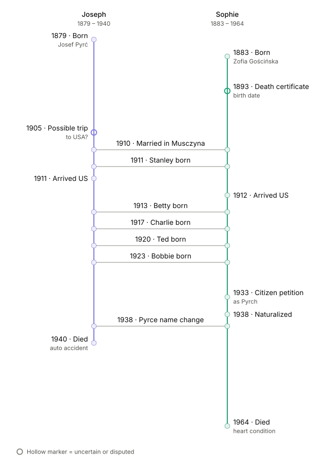

# The Pyrce family in America

The American family of Joseph and Sophie came to use the name **Pyrce**, derived from the Polish name **Pyrć** of Joseph/Józef.

Most of this Pyrce family history is from
a 1933 [Petition for Citizenship](<../../media/SophieJoseph/1933 - Citizenship Petition.png>) for Sophie. 
Sophie lists her surname as **Pyrch**.
She states that she had resided in the United States since May 1912. The [1913 passenger manifest](<../../media/SophieJoseph/1913 - Zofia Goscinska Manifest - line 2.gif>) in this collection is dated February 4, 1913, roughly confirming this.
She was then living at 2406 South Spaulding Avenue in Chicago with her children.

The petition lists the five children:

| Name | Birth date | Birth place | Referenced Polish name |
| --- | --- | --- | --- |
| Stanley John | Nov.? 5, 1911 | Poland | Stanisław |
| Bernice Rose | Aug. 1, 1914 | Chicago | Bronisława |
| Charles Lewis | May? 4, 1919 | Chicago | Karol |
| Taddeus Matthew | Feb. 19, 1920 | Chicago | Tadeusz |
| Stella | June 16, 1923 | Chicago | Stefania |

In 1933, this document uses Americanized forms of the original Polish children’s names. 

Sophie became a naturalized U.S. citizen on March 22, 1938, five years after the petition. The reverse of the [naturalization record](<../../media/SophieJoseph/1938 - Naturalization - Back.tif>) records a name change to **Sophie Pyrce**.
Later records for Sophie and her children use **Pyrce**.

Some time around this date the family moved to 4307 South Sawyer Ave in Chicago.

There are conflicts in the records:

- Genealogy Chart S2 "Gościńscy z Wapiennego" notes that (translated from Polish) "Zofia zd Gościińska Emigr. to Chicago, there she got married".  But the Petition for Citizenship says that she was married in Muszyna, Poland and that Stanley was born in Poland.  The notation in S2 seems unlikely.
- Sophie's birth date is given as 1883 in the Petition for Citizenship and Naturalization papers, which were either prepared by her or under her direction.  But her Death Certificate gives her birth date as 1893.  It seems unlikely that the Death Certificate is more accurate.
- A record is available from the Ellis Island archives that shows a Josef Pyrc arriving at New York in 1905, originating from Muszyna (in Prussia), with roughly the same age as Joseph would have been.  The Petition for Citizenship says that Joseph arrived in the USA in 1911, and it also states that they were married in Poland. It is not clear if this is the same person.

Both of the referenced homes still exist.
