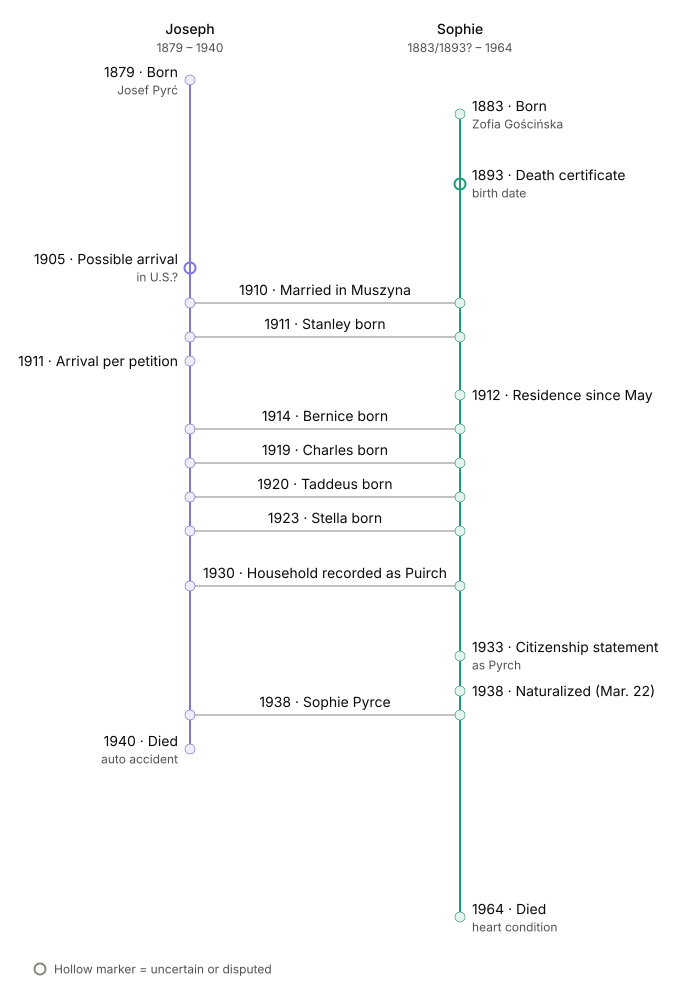

# The Pyrce family in America

Józef (Joseph) Pyrć and Zofia (Sophie) Gościńska came from Muszyna, in the
historical region of Galicia, then part of Austria-Hungary and now in southern
Poland. Records preserve several spellings of their names. Their American
family used **Pyrce**, while Sophie’s 1933 citizenship papers use **Pyrch**.

## Chicago, 1930

The 1930 U.S. population schedule for Chicago, Cook County, Illinois (enumerated
April 15, 1930; sheet 19-A, enumeration district 16-824, household at 2406 S.
Spaulding Ave.) records the surname as **Puirch**. It lists Joseph, Sophie, and
five children. Joseph’s occupation is recorded as laborer in a steel factory;
Sophie’s as laborer in a pie factory. “Puirch” may be a spelling used by the
family or an enumerator’s rendering; this record alone cannot tell us which.
The census image is titled “1930 - Census as Puirch.jpg” in the family archive.

## Sophie’s citizenship papers

In her 1933 “Statement of Facts to Be Used in Filing My Petition for
Citizenship,” Sophie gives her name as **Sophia Pyrch**, her residence as 2406
S. Spaulding Ave., and her continuous U.S. residence as beginning in May 1912.
She says she married Joseph in Muszyna on March 12, 1910, and that he arrived
in the United States in 1911. The form gives Joseph’s birth date as March 8,
1881; other family records give 1879, so the timeline retains 1879 as an
unresolved family date rather than treating the petition as conclusive.

The statement lists five children. The handwritten entries give these dates
and places of birth (some handwriting is difficult to read):

| Name as written | Date and place in the statement | Polish form or family name |
| --- | --- | --- |
| Stanley John | November 5, 1911, Poland | Stanisław |
| Bernice Rose | August 1, 1914, Chicago | Bronisława |
| Charles Lewis | May 4, 1919, Chicago | Karol |
| Taddeus Matthew | February 19, 1920, Chicago | Tadeusz |
| Stella | June 16, 1923, Chicago | Stefania |

These dates correct the earlier timeline entries for Bernice and Charles. The
petition uses Americanized forms alongside the Polish names.

Sophie was naturalized on March 22, 1938. Her naturalization record’s reverse
records the name change to **Sophie Pyrce**. Later records use Pyrce. The
family was at 2406 S. Spaulding when Sophie filed her 1933 statement; a later
family note places them at 4307 S. Sawyer Ave. The available records here do
not establish when the move occurred.

## Immigration records and unresolved conflicts

The 1913 passenger manifest for the S.S. *Kaiser Wilhelm II*, sailing from
Bremen and arriving February 4, 1913, has an entry for Zofia Goscinska, age 18.
It gives Muszyna as her last residence, names Jozef Goscinski as the husband
she was joining, and gives Sioux City, Iowa, as her destination. Those details
do not align cleanly with Sophie’s 1933 statement: she gives May 1912 as the
start of continuous U.S. residence and says she married Joseph Pyrć in Muszyna
in 1910. The manifest may concern Sophie, but the different husband’s surname,
destination, and arrival year leave that identification uncertain. The source
is archived as “1913 - Zofia Goscinska Manifest.gif,” line 2.

A separate manifest records Josef Pyrc, age 23, arriving in New York aboard
the S.S. *Pretoria* on December 13, 1905. The name and approximate age make
him a possible match for Joseph, but the 1933 statement instead gives Joseph’s
arrival as 1911. The 1905 entry should therefore remain a possible earlier
arrival, not be assigned to him as fact. The image is archived as “1905 -
Josef Pyrc Pretoria Manifest? (line 5).gif.”

The family chart S2, “Gościńscy z Wapiennego,” says Zofia née Gościńska
emigrated to Chicago and married there. That conflicts with Sophie’s own 1933
statement of a 1910 marriage in Muszyna and Stanley’s birth in Poland in 1911.
The chart’s note and Sophie’s statement are both retained; the discrepancy is
not resolved here.

Sophie’s birth year is another conflict. Her 1933 citizenship statement and
1938 naturalization papers give 1883, while her 1964 death certificate gives
1893. The passenger manifest’s age of 18 in February 1913 would imply a birth
around 1894–1895 if it is the same woman. These records do not establish a
single certain birth year.

### Record references

- 1930 U.S. census population schedule, Chicago, Cook County, Illinois, sheet
  19-A, enumeration district 16-824, household at 2406 S. Spaulding Ave.;
  archived image: “1930 - Census as Puirch.jpg.”
- Sophie Pyrch, “Statement of Facts to Be Used in Filing My Petition for
  Citizenship,” 1933, page 3; archived image: “1933 - Citizenship Petition.png.”
- S.S. *Kaiser Wilhelm II* passenger manifest, arrival February 4, 1913, line
  2, Zofia Goscinska; archived image: “1913 - Zofia Goscinska Manifest.gif.”
- S.S. *Pretoria* passenger manifest, arrival December 13, 1905, line 5, Josef
  Pyrc; archived image: “1905 - Josef Pyrc Pretoria Manifest? (line 5).gif.”
- Sophie’s naturalization record, reverse, March 22, 1938; archived image:
  “1938 - Naturalization - Back.tif.”
